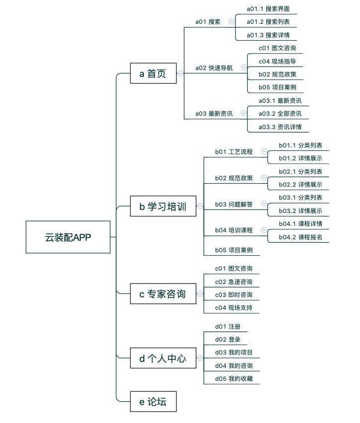
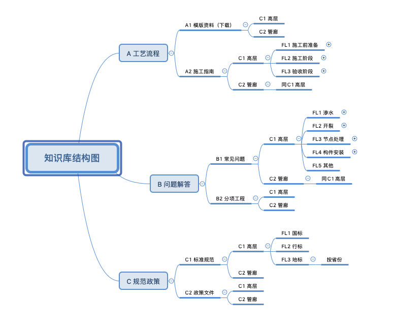
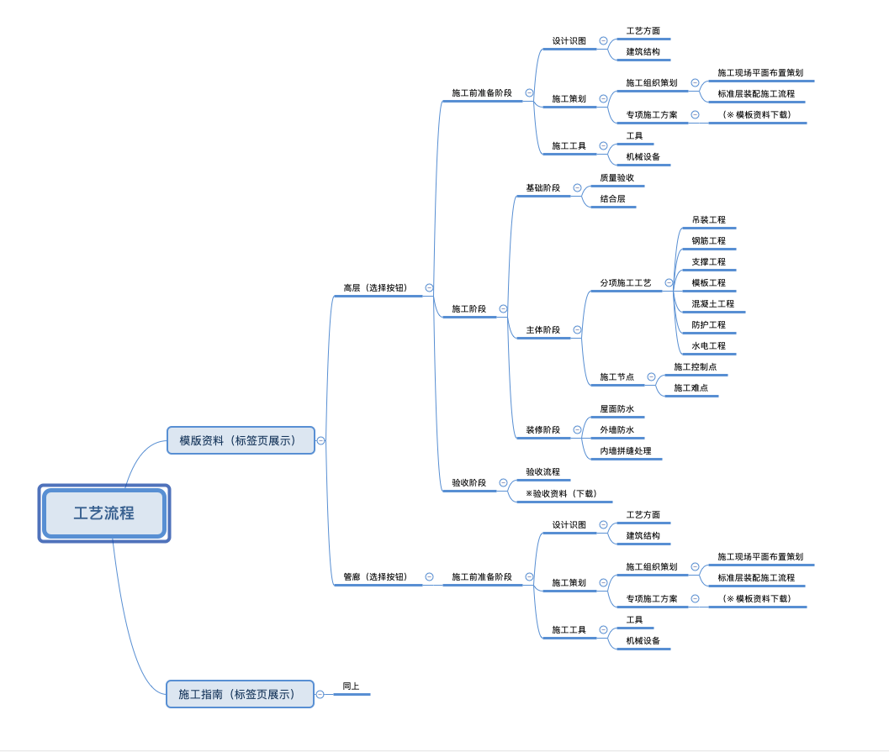
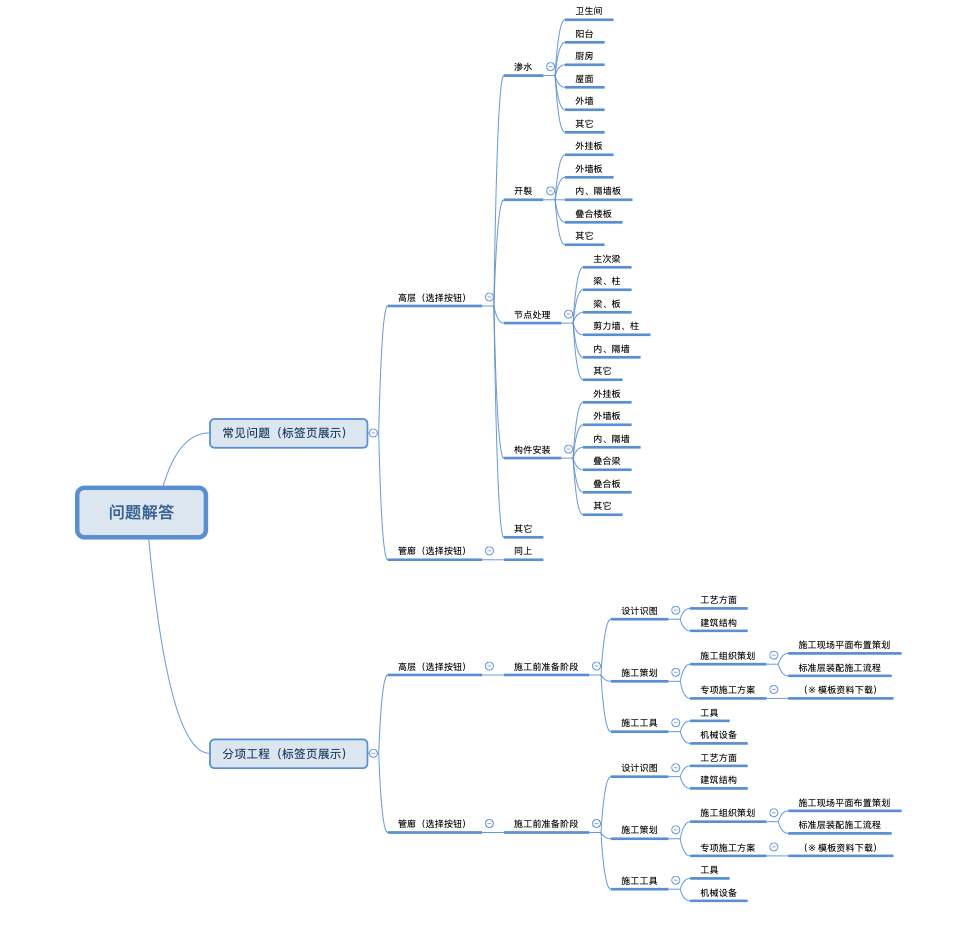
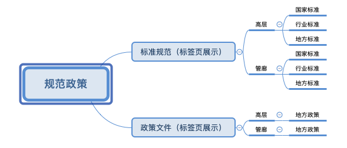
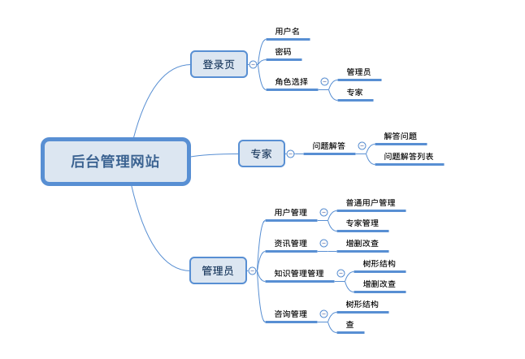

# 本项目为商业项目，为保证甲方的合法权益，Public仓库不包含具体代码。
* 项目情况
    1. 项目简介：云装配是一款面向建筑师的装配式建筑服务软件。建筑师可以快速寻找施工方案，免费下载海量资源，线上咨询专家线下课程培训。
    2. 项目详情：
       * 装配式建筑正是建筑工业化的重要一环。所谓装配式建筑，是指在工厂内生产楼板、墙板、楼梯等各种预制构件，然后运到工地装配而成的建筑。这种建筑的优点是建造速度快，受气候条件制约小，节约劳动力并可提高建筑质量。在法国、瑞典、德国、丹麦、荷兰、新加坡等地，装配式建筑的比例相对较高，其中瑞典的住宅预制构件比例达到95%。   
       * 2016年2月，中共中央、国务院去年发布的《关于进一步加强城市规划建设管理工作的若干意见》中，明确“力争用10年左右时间，使装配式建筑占新建建筑的比例达到30%”的目标，并指出要“积极稳妥推广钢结构建筑”、“在具备条件的地方，倡导发展现代木结构建筑”。   
       * 长沙远大住宅为满足国家装配式建筑发展的需要，开发了一款面向建筑师的装配式建筑服务软件。该软件主要包含移动端（Android、iOS）以及管理后台两部分。移动端包含的功能主要包含首页咨询、学习培训、专家咨询三大功能模块，后台管理系统主要包含用户、资讯、知识库管理及专家解答两大功能模块（*详见下方XMind思维导图*）。
    3. 人员及分工：项目主要开发人员为3人，本人是Java后台开发，主要负责开发APP后台及管理后台的全部功能；其余两人分别负责Android及iOS端的开发工作。
    4. 后台技术栈：SpringBoot+MyBatis+MySQL+Redis
    4. 项目功能点：
        1. APP后台功能（APP功能） 
           
           
           
           
           
        2. 后台管理功能
           
